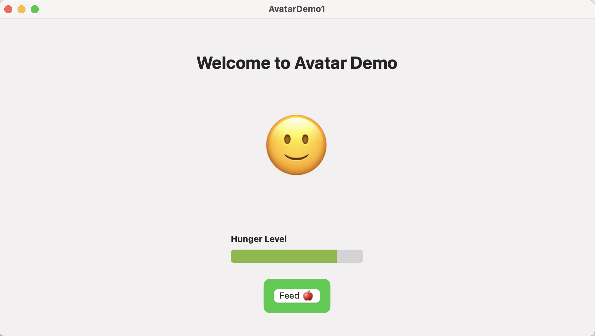
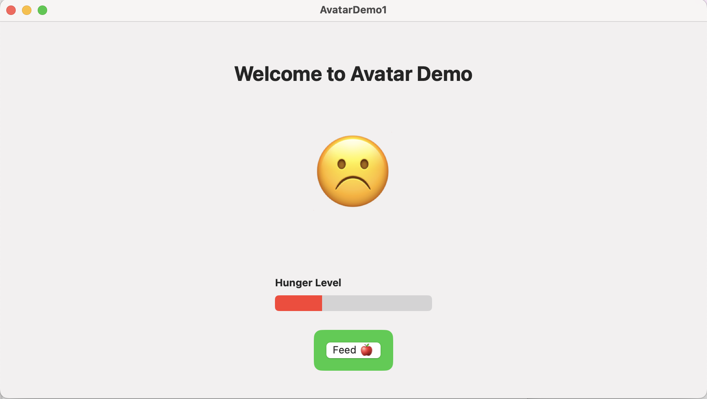

# AvatarDemo1 App

# App Description
This app is a simple implementation of a semi-interactive avatar. In this case, an emoji is used to represent the avatar. Over time, the avatar grows "hungry", and its hunger bar reflects those changes. As the hunger level increases, the emoji shifts from a smiling face to a frowning face, a further indication to the user that it is time for the avatar to be fed.
The user can use the "Feed" button to reset the avatar's hunger level and return the emoji to its default happy state.

# Features
- Avatar that displays 2 emotions: smile and frown
- Hunger bar that shows the user the avatar's hunger level
- Timer that tracks the time to determine avatar's hunger level
- Feed button that user can use to "refill" the avatar

# Project Structure
## AvatarDemo1App.swift - displays app view when started

## ContentView.swift - sets up app view
View
- implements a VStack to stack elements on the screen
- features text 'Welcome to Avatar Demo'
- positions emoji below text, changes based on hunger state
- uses a VStack to stack label and hunger bar, which transitions from green to red as the fullness level goes down, indicating the avatar's increasing hunger level
- feed button that user can click to reset avatar's state

# Variables
- boolean isHappy -> true or false, whether avatar is happy
- int hungerLevel -> starts at 0, gradually increases until fed
- hungerThreshold = 5 -> when hunger level reaches this threshold, avatar becomes sad
- maxHunger = 10 -> the bottom of the hunger bar

# Functions
## startHungerTimer()
- starts running a timer, checks hunger level every 3 seconds
- raises hunger level by 1 every 3 seconds unless it is below preset hunger threshold (5)
- once hunger level reaches threshold, isHappy changes to false
- if hunger reaches max hunger level, timer stops until avatar is refed
 
## feedAvatar()
- resets hunger level to 0
- resets isHappy to true

# Screenshots

## Author
Adina Gross
